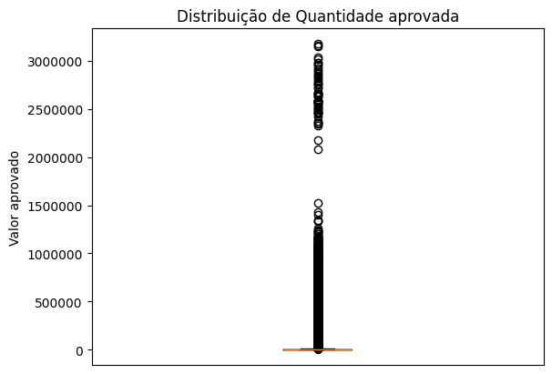
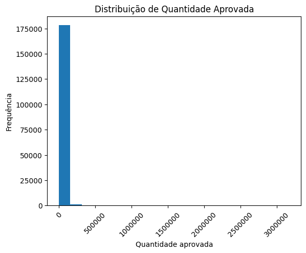
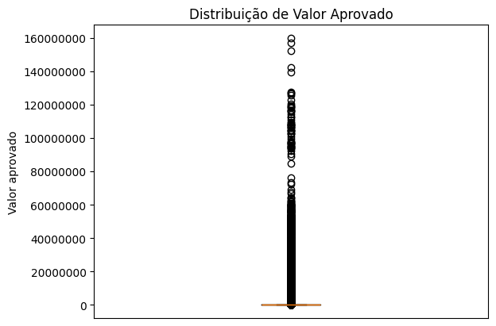
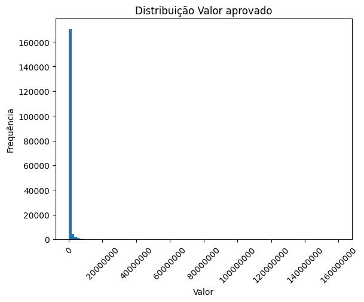

# Data-SUS
Esse é o projeto da máteria de Projeto Integrador 3 do curso de Ciência de Dados e Inteligência Artificial do IESB

## Resumo
O projeto envolveu a coleta, tratamento e análise de dados do site Data-SUS, referentes aos anos de 2019 a 2023. Os dados foram utilizados para avaliar a qualidade e características dos procedimentos de saúde. A análise demonstrou a viabilidade de usar esses dados para insights sobre a saúde pública.

## Web Scraping
O Web Scraping (Raspagem de Dados) foi realizado utilizando a biblioteca Selenium, uma ferramenta de automação de navegador, com um código desenvolvido em Python, disponível no arquivo utils/get_data.py. Esse código acessa o site do Data-SUS para baixar os dados dos anos de 2019 a 2023, filtrando os dados com base no "Subgrupo de Procedimentos" e coletando informações como "Quantidade Aprovada" e "Valor Aprovado".

Além disso, o mesmo código foi empregado para realizar um pré-processamento inicial dos dados. Esse processo envolveu a transformação dos dados em um DataFrame e sua posterior salvaguarda em um único arquivo CSV.

## Carga no Postgres
O arquivo resultante do Web Scraping passou por um processo de tratamento para permitir sua importação para o banco de dados Postgres. A carga foi realizada utilizando o DBeaver, uma ferramenta de administração de banco de dados. Além disso, os dados do censo de 2022 foram carregados no mesmo esquema, visando a obtenção de informações como latitude, longitude e população. O código a seguir ilustra como a consulta foi executada:

```sql
select resultado."Código Município", resultado." Município", resultado." Ano", resultado." Mes" , resultado." Conteudo", resultado. " Total", censo."LONGITUDE", censo."LATITUDE" , censo."NU_Populacao" 
from data_sus.resultado as resultado
inner join censo as censo
on resultado."Código Município" = censo."CODIGO_MUNICIPIO" 
```

## Qualidade dos Dados
Para avaliar a qualidade dos dados, foram conduzidas análises estatísticas e gráficas. A análise estatística foi realizada com o auxílio da biblioteca Pandas e NumPy, enquanto a análise gráfica foi feita utilizando a biblioteca Matplotlib.

Após a análise, verificou-se que os dados apresentam diversos valores nulos, o que não compromete a análise, pois esses valores correspondem a procedimentos não realizados. Outro ponto observado foi a grande dispersão dos dados, essa dispersão é comum devido à distribuição demográfica do Brasil, que possui muitos municípios pequenos e poucos municípios grandes.

Os seguintes gráficos foram gerados para ilustrar a qualidade dos dados:

- Quantidade de procedimentos realizados por município
    
    

- Valor de procedimentos realizados por município
    
    
